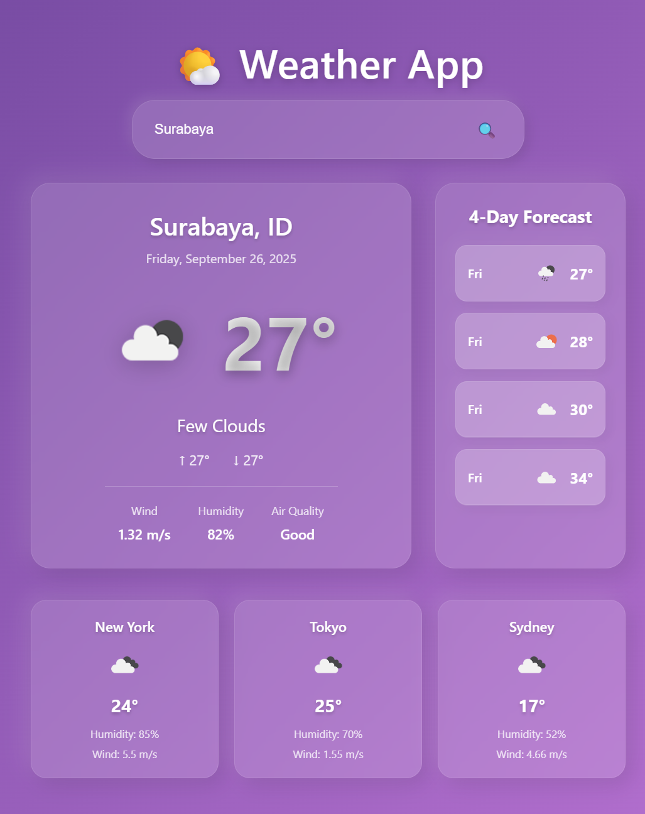

# Weather App React

A beautiful and responsive weather application built with React and Vite that displays current weather conditions and forecasts.

## Features

- Current weather conditions (temperature, humidity, wind, pressure)
- 5-day weather forecast
- Search for weather in different cities
- Auto-suggest city names as you type
- Responsive design for all devices
- Beautiful neumorphic UI with gradient backgrounds and modern styling
- Real-time weather data from OpenWeatherMap API

## Screenshot



## Setup

1. Get a free API key from [OpenWeatherMap](https://openweathermap.org/api)
2. Clone this repository
3. Install dependencies: `npm install`
4. Create a `.env` file in the root directory with your API key:
   ```
   VITE_OPENWEATHER_API_KEY=your_actual_api_key_here
   ```
5. Create a `screenshots` directory and add your screenshot (optional):
   ```
   mkdir screenshots
   # Add your screenshot as screenshots/weather-app-screenshot.png
   ```
6. Start the development server: `npm run dev`

## Technologies Used

- React
- Vite
- Axios
- OpenWeatherMap API
- CSS3 with Flexbox/Grid

## API Usage

This app uses the OpenWeatherMap API to fetch real weather data. You can find more information about the API endpoints used:
- Current weather: `/data/2.5/weather`
- 5-day forecast: `/data/2.5/forecast`
- City geocoding: `/geo/1.0/direct`

## Contributing

Feel free to submit issues or pull requests to improve the application.

## Docker Deployment

This application can be easily deployed using Docker. To build and run the application in a container:

### Using Docker:
```bash
# Build the image
docker build -t weather-app-react .

# Run the container
docker run -p 8080:80 weather-app-react
```

### Using Docker Compose:
```bash
# Build and run with docker-compose
docker-compose up --build
```

The application will be available at `http://localhost:8080`

## Screenshots Directory

If you'd like to add your own screenshots of the app:
1. Create a `screenshots` directory in the project root
2. Add your screenshots with descriptive names (e.g., `desktop-view.png`, `mobile-view.png`, `search-suggestions.png`)
3. Update this README to showcase your screenshots
